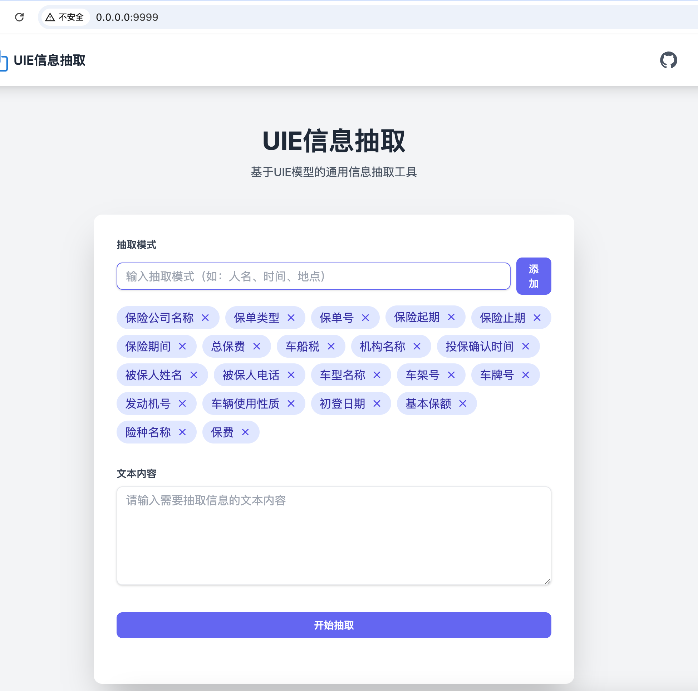

# UIE 信息抽取服务

基于 UIE（Universal Information Extraction）模型的通用信息抽取服务，提供简单易用的 REST API 接口，支持多种设备加速。

## 功能特点

- 基于 UIE 模型的通用信息抽取能力
- 提供 RESTful API 接口
- 支持多种设备加速（CUDA/MPS/CPU）
- 简洁的 Web 界面
- 支持自定义抽取模式

## 环境要求

- Python 3.x
- PyTorch
- FastAPI
- transformers

## 安装

1. 克隆项目代码：

```bash
git clone [项目地址]
cd uie
```

2. 安装依赖：

```bash
pip install -r requirements.txt
```

## 启动服务

```bash
python main.py --port 9999
```

服务默认运行在 `http://localhost:9999`

## API 接口

### 信息抽取

- **接口**: `/extract`
- **方法**: POST
- **请求体**:
  ```json
  {
    "text": "待抽取的文本内容",
    "schema_list": ["人名", "时间", "地点"]
  }
  ```
- **响应**:
  ```json
  {
    "人名": [...],
    "时间": [...],
    "地点": [...]
  }
  ```

## 设备加速支持

服务会自动检测可用的硬件设备，按以下优先级选择：

1. CUDA (如果有 NVIDIA GPU)
2. MPS (如果是 Apple Silicon Mac)
3. CPU (默认)

## Web 界面

访问 `http://localhost:9999` 可以使用 Web 界面进行信息抽取测试。



## 示例代码

```python
import requests

url = "http://localhost:9999/extract"
data = {
    "text": "2021年10月1日，张三在北京参加了会议。",
    "schema_list": ["人名", "时间", "地点"]
}

response = requests.post(url, json=data)
print(response.json())
```
